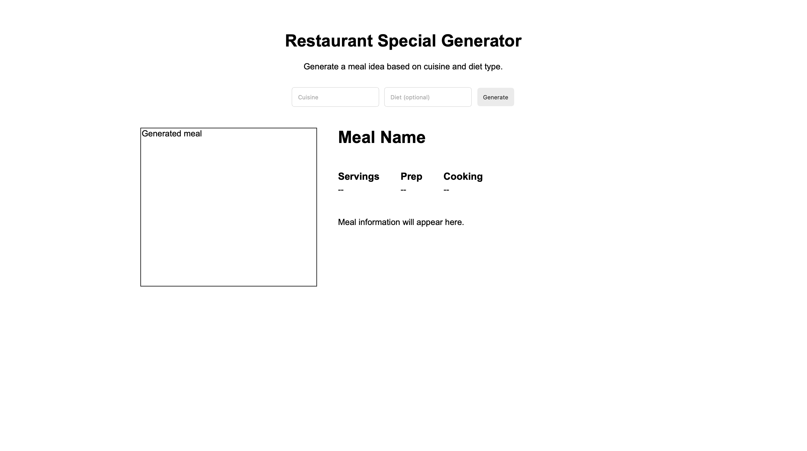

# Restaurant Special Generator

A simple meal generator built using HTML, CSS, and JavaScript.

## About

This application allows users to select a cuisine and diet type to generate a meal idea that matches their choices. The project uses an API to retrieve meal information and display a restaurant special based on the user's input.

## Screenshot

## Built With

- HTML
- CSS
- JavaScript
- Meal API

## What I Practiced

- Fetching data from an API
- Working with JSON data
- Using multiple user inputs in an API request
- DOM manipulation
- Handling user selections
- Displaying API results on the page